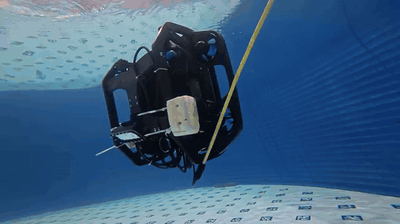
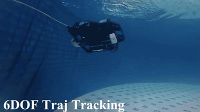
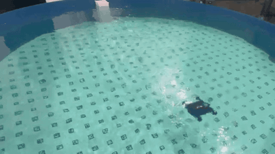

# underwater_ros2_control

ROS 2 control stack for underwater robots. The repository combines Gazebo
simulation, `ros2_control` hardware interfaces, acados NMPC control, keyboard
teleoperation, and robot descriptions for BlueROV2 Heavy and Subcat.

This project is a research and engineering prototype. The real-hardware backend
can send actuator commands through MAVROS RC override and serial servos, so use
it only with an emergency stop, actuator limits, removed propellers, or a
controlled test tank.

## Real-World Experiments

<p align="center">
  
  
  
</p>

## Packages

```text
underwater_ros2_control/
|-- command/keyboard_input/              # Keyboard command node
|-- controllers/acados_nmpc_controller/  # NMPC ros2_control controller
|-- descriptions/bluerov/bluerov2_heavy/ # BlueROV2 Heavy model and launch files
|-- descriptions/subcat/                 # Subcat model and launch files
|-- hardwares/gz_underwater_hardware/    # Gazebo underwater hardware interface
|-- hardwares/real_underwater_hardware/  # MAVROS and serial hardware interface
|-- docs/launch_guide.md                 # Launch examples and quick checks
|-- docs/matlab_models.md                # MATLAB/acados model workflow
`-- LICENSE
```

## Requirements

Recommended environment:

- Ubuntu 24.04
- ROS 2 Jazzy
- Gazebo Harmonic / `ros_gz`
- `colcon`, `rosdep`, and `ament_cmake`
- acados v0.4.5, with `ACADOS_INSTALL_DIR` set

Main runtime packages include `controller_manager`, `hardware_interface`,
`joint_state_broadcaster`, `imu_sensor_broadcaster`, `robot_state_publisher`,
`xacro`, `rviz2`, `ros_gz_sim`, `ros_gz_bridge`, and `mavros_msgs`.

## Build

```bash
cd ~/underwater_ws
source /opt/ros/jazzy/setup.bash
rosdep install --from-paths src --ignore-src -r -y
```

Install acados v0.4.5 before building the controller:

```bash
sudo apt update
sudo apt install -y git build-essential cmake python3 python3-pip

git clone https://github.com/acados/acados.git $HOME/acados
cd $HOME/acados
git checkout v0.4.5
git submodule update --init --recursive

mkdir -p build
cd build
cmake -DACADOS_INSTALL_DIR=$HOME/acados ..
cmake --build . --target install -j$(nproc)
```

Export the acados environment before building or running the controller:

```bash
export ACADOS_INSTALL_DIR=$HOME/acados
export LD_LIBRARY_PATH=$ACADOS_INSTALL_DIR/lib:$LD_LIBRARY_PATH
```

For MATLAB/Octave setup, follow the official acados guide:
[MATLAB + Simulink and Octave Interface](https://docs.acados.org/matlab_octave_interface/index.html).
Keep this repository on the `v0.4.5` acados checkout when generating its solvers.
CasADi 3.7 has also been tested successfully with these MATLAB models.

Build the main workspace packages:

```bash
colcon build --symlink-install --packages-select \
  acados_nmpc_controller \
  gz_underwater_hardware \
  real_underwater_hardware \
  bluerov2_heavy \
  subcat \
  keyboard_input
source install/setup.bash
```

Simulation-only builds can skip `real_underwater_hardware` if MAVROS message
dependencies are not installed.

## Run

Single Subcat simulation:

```bash
ros2 launch subcat gz.launch.py \
  robot_name:=subcat \
  robot_namespace:=sub1 \
  x:=0.0 \
  y:=0.0 \
  height:=-3.0 \
  rviz_config:=single \
  merge_tf:=true
```

Single BlueROV2 Heavy simulation:

```bash
ros2 launch bluerov2_heavy gz.launch.py \
  robot_name:=bluerov2_heavy \
  robot_namespace:=rov1 \
  x:=0.0 \
  y:=0.0 \
  height:=-1.0 \
  rviz_config:=single \
  merge_tf:=true
```

More simulation, multi-robot, real-hardware, keyboard, and debug commands are in
[docs/launch_guide.md](docs/launch_guide.md).

## Keyboard Control

```bash
ros2 launch keyboard_input keyboard.launch.py
```

The keyboard node publishes:

- `/<robot_namespace>/control_input`, type `std_msgs/msg/Int8`
- `/<robot_namespace>/cmd_vel`, type `geometry_msgs/msg/Twist`

Mode keys are `1` for stop, `2` for auto, and `3` for manual. Movement keys are
listed in the launch guide.

## Configuration

Robot launch and controller parameters are mainly stored under:

- `descriptions/bluerov/bluerov2_heavy/config/`
- `descriptions/subcat/config/`
- `descriptions/bluerov/bluerov2_heavy/urdf/`
- `descriptions/subcat/urdf/`

acados solver metadata lives under:

```text
controllers/acados_nmpc_controller/solvers/<solver_id>/solver.yaml
```

Generated solver code is expected through each solver's `c_generated_code`
directory. Check those links if CMake cannot find generated acados headers.
See [docs/matlab_models.md](docs/matlab_models.md) before changing or
regenerating robot MATLAB/acados models.

## Development

- Add new robots as description/config/launch packages.
- Reuse `acados_nmpc_controller`, `gz_underwater_hardware`, and
  `real_underwater_hardware` where possible.
- Keep robot namespaces and Gazebo model names unique in multi-robot sessions.
- Rebuild and source the workspace after changing URDF, xacro, controller
  plugins, or generated solver code.

## License and Acknowledgements

The root repository is licensed under the [Apache License 2.0](LICENSE). Some
description packages currently declare BSD in their `package.xml` files. Check
third-party models, meshes, MATLAB/acados generated code, and upstream
dependencies for their own license terms.

This project was inspired by
[legubiao/quadruped_ros2_control](https://github.com/legubiao/quadruped_ros2_control)
and adapted for underwater robot simulation, control, and hardware integration.
